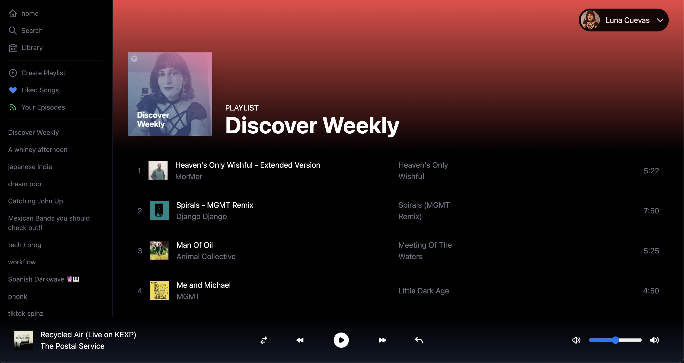

## Table of contents

- [Overview](#overview)
  - [Screenshot](#screenshot)
  - [Links](#links)
- [My process](#my-process)
  - [Built with](#built-with)
  - [What I learned](#what-i-learned)
  - [Continued development](#continued-development)
- [Acknowledgments](#acknowledgments)

## Overview

### Screenshot



### Links

- Live Site URL: [Demo](https://spotify-clone-luna-cuevas.vercel.app/)

## My process

Hey, I made this project with the intent of learning new tech. In particular, I was curious to learn how to use TailwindCSS and I'm also continuing my studies on Next.js and NextAuth.

The goal of this project was to create a spotify clone and use the Spotify API to remotely control the app. To do this I would need to create a login screen/button to validate a user's id and authentication token and then communicate with the Spotify API. Once the user's token is validated, they will be forwarded to the main screen for the app.

The main screen uses Tailwind utility classes to give a close representation of the Spotify app. The power of Tailwind is that instead of manually setting media breakpoints, you only need to set classes like "sm:space-x-3" which translates to "on small screens, set padding to 3 pixels." Additionally, I found that the time I would normally spend on styling could be used to make the app better.

I pulled data using the API from my actual spotify profile to map out songs, descriptions, song length, and album art.

### Built with

- Semantic HTML5 markup
- CSS custom properties
- Flexbox
- Mobile-first workflow
- [React](https://reactjs.org/) - JS library
- [Next.js](https://nextjs.org/) - React framework
- [TailwindCSS](https://tailwindcss.com/) - For styles

### What I learned

I learned that Tailwind CSS is natively mobile-first so things like media breakpoints go "Up" and mixing the order of things like md:bg-blue sm:bg-red instead of sm being before md, then breakpoints wont function correctly.

Some code i'm proud of is featured below. In this example, I realized that I would be creating a lot of repeated blocks so I decided to quickly build a JSON object with the title, image, and description for each of the blocks I needed to build.

If I was working with a database, I would create an API endpoint to fetch this JSON object from the database.

Some code I'm proud of is this nextAuth component where I made a login request to the SpotifyAPI using the required credentials, don't worry these credentials aren't public, and if successful would set the user token. If at any point, the user tokens don't match then the user would be directed to the login screen.

```js
async function refreshAccessToken(token) {
  try {
    spotifyAPI.setAccessToken(token.accessToken)
    spotifyAPI.setAccessToken(token.refreshToken)

    const { body: refreshedToken } = await spotifyAPI.refreshAccessToken()
    console.log('REFRESHED TOKEN IS', refreshedToken)

    return {
      ...token,
      accessToken: refreshedToken.access_token,
      accessTokenExpires: Date.now + refreshedToken.expires_in * 1000,
      refreshToken: refreshedToken.refresh_token ?? token.refreshToken,
    }
  } catch (error) {
    console.log(error)

    return {
      ...token,
      error: 'RefreshAccessTokenError',
    }
  }
}

export default NextAuth({
  // Configure one or more authentication providers
  providers: [
    SpotifyProvider({
      clientId: process.env.NEXT_PUBLIC_CLIENT_ID,
      clientSecret: process.env.NEXT_PUBLIC_CLIENT_SECRET,
      authorization: LOGIN_URL,
    }),
    // ...add more providers here
  ],
  secret: process.env.JWT_SECRET,
  pages: {
    signIn: '/login',
  },
  callbacks: {
    async jwt({ token, account, user }) {
      if (account && user) {
        return {
          ...token,
          accessToken: account.access_token,
          refreshToken: account.refresh_token,
          username: account.providerAccountId,
          accessTokenExpires: account.expires_at * 1000,
        }
      }
      if (Date.now() < token.accessTokenExpires) {
        console.log('EXISTING ACCESS TOKEN IS VALID')
        return token
      }
      // Access token has expired, so we need to refresh it...
      console.log('ACCESS TOKEN HAS EXPIRED, REFRESHING...')
      return await refreshAccessToken(token)
    },
    async session({ session, token }) {
      session.user.accessToken = token.accessToken
      session.user.refreshToken = token.refreshToken
      session.user.username = token.username

      return session
    },
  },
})
```

### Continued development

Challenges I currently am working through is getting the prev/next buttons to function correctly. It seems like the node wrapper I used for the Spotify API needs to be updated and the next() and prev() functions don't work as intended. I looked up the issue and it seems that their team is working on it. Instead of scrapping this project, I'm spending time reading through the Spotify API docs to see if I can just make that call myself.

## Acknowledgments

This is a hodgepodge, a combination of various tutorials and snippets on youtube, stack overflow, and google.
